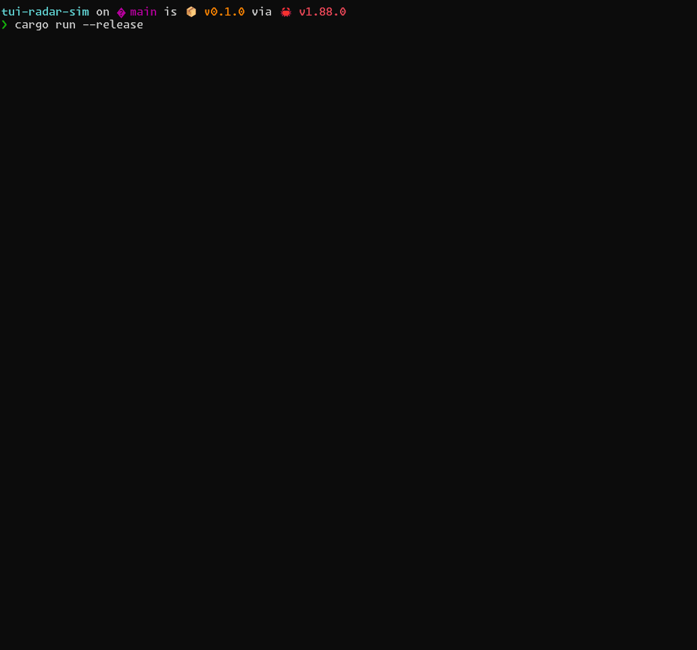

# TUI Radar Simulation



This is a simple "radar sim" I made using Ratatui, mostly to try out creating a real-time event/render loop in pure Rust and just using threads, no async runtime(like tokio).

Using `mpsc` (multi-producer single consumer) channels to pass messages from background threads back to my main loop to be processed without blocking. 

The threadpool isn't being used at all and was just something left over, but close to "production worthy" it's just expanded on from the book. I'll probably later move it to a dedicated repo.

## How it works
The program runs on two threads.
An input thread handles user events; while it could all run on a single thread, splitting input off makes everything smoother once more keys or events are involved.
Rendering and tick/update logic both run at fixed rates in the main thread — typically 30 FPS (frames per second) and 15 TPS (ticks per second).
There is a small sleep at the end of the main loop to yield back control to the OS so the loop isn't needlessly run. 
I'm using an Elm style Model–Update–View (MUV) pattern, All the state lives in `Model`,
events are sent as `Message`s to an `Update()` function that mutates the `Model` which is rendered by `View()`

```rust
//src/tui.rs
pub fn run(&mut self) -> MyResult<()> {
    self.enter()?;

    let tick_duration = Duration::from_secs_f64(1.0 / self.tick_rate);
    let frame_duration = Duration::from_secs_f64(1.0 / self.frame_rate);

    let now = Instant::now();
    let mut last_tick = now;
    let mut last_frame = now;

    // Spawn input thread
    let input_tx = self.msg_tx.clone();
    thread::spawn(move || {
        // This thread blocks safely on input and sends key events to main thread
        loop {
            if let Ok(Event::Key(key)) = crossterm::event::read() {
                if key.kind == KeyEventKind::Press {
                    if input_tx.send(Message::KeyPress(key.code)).is_err() {
                        break; // main thread exited
                    }
                }
            }
        }
    });

    // main thread loop
    loop {
        // Handle incoming messages (non-blocking)
        while let Ok(msg) = self.msg_rx.try_recv() {
            match self.update(&msg)? {
                UpdateCommand::Quit => {
                    self.exit()?;
                    return Ok(());
                }
                _ => {}
            }
        }

        let now = Instant::now();

        // Tick logic
        if now >= last_tick + tick_duration {
            self.update(&Message::Tick)?;
            last_tick += tick_duration;
        }

        // Render frame
        if now >= last_frame + frame_duration {
            self.update(&Message::Render)?;
            last_frame += frame_duration;
        }
        // sleep until next event, yield to CPU
        let next_tick = last_tick + tick_duration;
        let next_frame = last_frame + frame_duration;
        let next_event = std::cmp::min(next_tick, next_frame);
        let sleep_time = next_event.saturating_duration_since(Instant::now());

        thread::sleep(sleep_time);
    }
}
}
```

The radar sweeps around and detects different types of objects (aircraft, ships, etc) that move around and fade out over time or are removed if out of range. Everything is purely simulated, no real data is used. 


## Why threads instead of async?
I just wanted to see how it this felt compared to using `tokio`. For a simple TUI like this, threads are actually pretty nice, no async complexity, and the performance is fine for something simple like this. 
